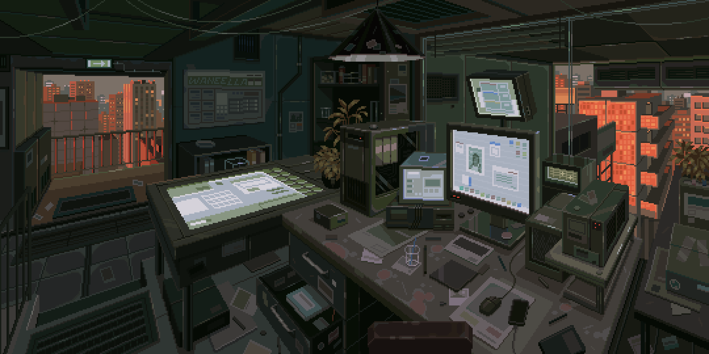
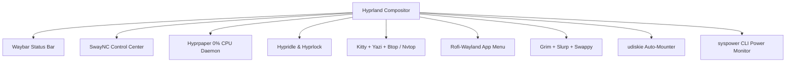

# 🌲 Gruvbox Hyprland Desktop Environment

A production-grade, ultra-lightweight, and power-optimized **Hyprland** desktop build styled in the warm **Gruvbox Dark** aesthetic.



---

## ⚡ Key Features

- **Compositor**: [Hyprland](https://hyprland.org/) with fluid Bezier window physics, rounded borders, active gradients, and dynamic blur.
- **Power & Thermal Engine**:
  - **PCIe ASPM (`powersupersave`)**: Deep link state power gating for NVMe SSDs, network cards, and GPU.
  - **Hyprpaper**: 0.0% idle CPU native C++ wallpaper daemon with instant IPC controls.
  - **`syspower`**: Built-in real-time terminal monitor for CPU package, GPU, and motherboard wattage breakdown.
- **Top Bar (Waybar)**:
  - Uniform hardware monitoring pills for **CPU** (Load %, Clock speed, Temp), **GPU** (Usage %, Clock, Temp, Power), and **System Total Power** (Watts).
  - RAM usage, active workspaces, active window title, and network upload/download bandwidth.
- **Notification & Control Center (SwayNC)**:
  - Slide-out control panel with volume/brightness sliders, Do Not Disturb, screenshot triggers, lock, and power off.
- **App Launcher (Rofi-Wayland)**:
  - Centered fuzzy search with Papirus app icons and keyboard navigation.
- **Terminal (Kitty)**:
  - Gruvbox Dark 256-color palette + JetBrains Mono Nerd Font.
- **Automount Daemon (`udiskie`)**:
  - Automatically mounts USB thumb drives and secondary internal/external partitions on boot/connection.

---

## 🏗️ Architecture



---

## 🚀 Quick Start & Installation

### 1. Clone the Repository
```bash
git clone https://github.com/<your-username>/hyprland-dotfiles.git ~/hyprland-dotfiles
cd ~/hyprland-dotfiles
```

### 2. Run the Interactive Installer
```bash
chmod +x install.sh setup-power.sh
./install.sh
```

The installer will:
1. Detect your package manager (`yay`, `paru`, or `pacman`).
2. Create an automatic timestamped backup of your existing configs (`~/.config/hyprland_backup_*`).
3. Deploy all configuration files into `~/.config/`.
4. Install `syspower` into `~/.local/bin/`.
5. Deploy wallpapers to `~/Pictures/Wallpapers/`.
6. Configure low-power PCIe ASPM and CPU energy states.

---

## ⌨️ Keybindings Cheat Sheet

### 🚀 Applications
| Shortcut | Action |
| :--- | :--- |
| <kbd>SUPER</kbd> + <kbd>Q</kbd> | Launch **Kitty** Terminal |
| <kbd>SUPER</kbd> + <kbd>Space</kbd> / <kbd>SUPER</kbd> + <kbd>R</kbd> | Open **Rofi** App Launcher |
| <kbd>SUPER</kbd> + <kbd>E</kbd> | Open **Yazi** File Manager (Terminal) |
| <kbd>SUPER</kbd> + <kbd>Shift</kbd> + <kbd>E</kbd> | Open **Nautilus** (GUI File Manager) |
| <kbd>SUPER</kbd> + <kbd>N</kbd> | Toggle **SwayNC** Notification Center |
| <kbd>SUPER</kbd> + <kbd>L</kbd> | Lock Screen with **Hyprlock** |
| <kbd>SUPER</kbd> + <kbd>W</kbd> | Randomize / Switch Wallpaper |
| <kbd>SUPER</kbd> + <kbd>B</kbd> | Open Web Browser |

### 🪟 Window Management
| Shortcut | Action |
| :--- | :--- |
| <kbd>SUPER</kbd> + <kbd>C</kbd> | Close active window |
| <kbd>SUPER</kbd> + <kbd>V</kbd> | Toggle floating mode |
| <kbd>SUPER</kbd> + <kbd>F</kbd> | Toggle fullscreen |
| <kbd>SUPER</kbd> + <kbd>P</kbd> | Toggle pseudo tiling |
| <kbd>SUPER</kbd> + <kbd>J</kbd> | Toggle split orientation |
| <kbd>SUPER</kbd> + <kbd>H/J/K/L</kbd> or <kbd>Arrows</kbd> | Focus window in direction |
| <kbd>SUPER</kbd> + <kbd>Shift</kbd> + <kbd>H/J/K/L</kbd> | Move window in direction |
| <kbd>SUPER</kbd> + <kbd>Left Mouse Click & Drag</kbd> | Move window |
| <kbd>SUPER</kbd> + <kbd>Right Mouse Click & Drag</kbd> | Resize window |

### 🔢 Workspaces
| Shortcut | Action |
| :--- | :--- |
| <kbd>SUPER</kbd> + <kbd>1..0</kbd> | Switch to workspace 1–10 |
| <kbd>SUPER</kbd> + <kbd>Shift</kbd> + <kbd>1..0</kbd> | Move active window to workspace 1–10 |
| <kbd>SUPER</kbd> + <kbd>S</kbd> | Toggle scratchpad (Magic workspace) |
| <kbd>SUPER</kbd> + <kbd>Shift</kbd> + <kbd>X</kbd> | Move active window to scratchpad |

### 📸 Screenshots
| Shortcut | Action |
| :--- | :--- |
| <kbd>SUPER</kbd> + <kbd>Shift</kbd> + <kbd>S</kbd> | Select area to clipboard & save |
| <kbd>Print</kbd> | Full screen capture to clipboard & save |
| <kbd>SUPER</kbd> + <kbd>Print</kbd> | Interactive screenshot annotation (**Swappy**) |

---

## ⚡ Power Optimization Tools

Check live power draw directly in your terminal:
```bash
# Instant snapshot
syspower

# Continuous live monitoring (updates every second)
syspower -w
```

Apply system-wide PCIe ASPM low-power states:
```bash
sudo ./setup-power.sh
```

---

## 📂 Repository Structure

```text
hyprland-dotfiles/
├── install.sh                     # Interactive master installer
├── setup-power.sh                 # Linux PCIe ASPM & CPU power tuning script
├── packages.txt                   # Manifest of Arch / CachyOS packages
├── README.md                      # Documentation & cheat sheets
├── bin/
│   └── syspower                   # Real-time terminal power monitor
├── config/
│   ├── hypr/                      # Hyprland, Hyprlock, Hypridle, Hyprpaper
│   ├── waybar/                    # Waybar config, style, and monitor scripts
│   ├── swaync/                    # SwayNC notification center & widget panel
│   ├── rofi/                      # Rofi launcher & Gruvbox theme
│   ├── kitty/                     # Kitty terminal configuration
│   └── btop/                      # btop resource monitor configuration
└── wallpapers/                    # Curated Gruvbox & Retro Terminal wallpapers
```
